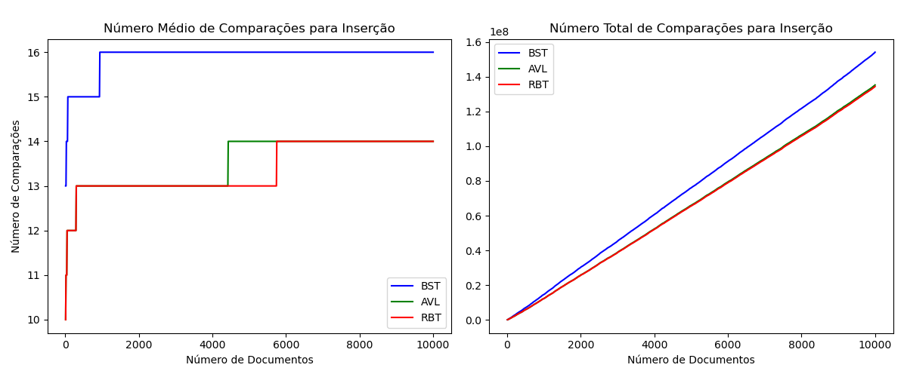
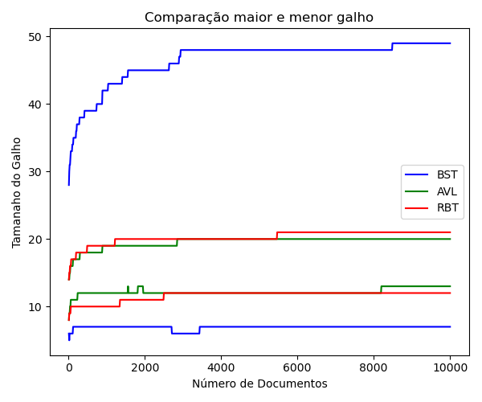
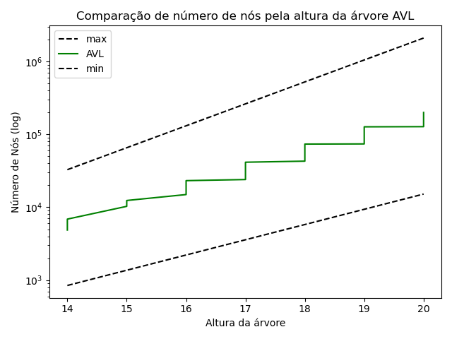
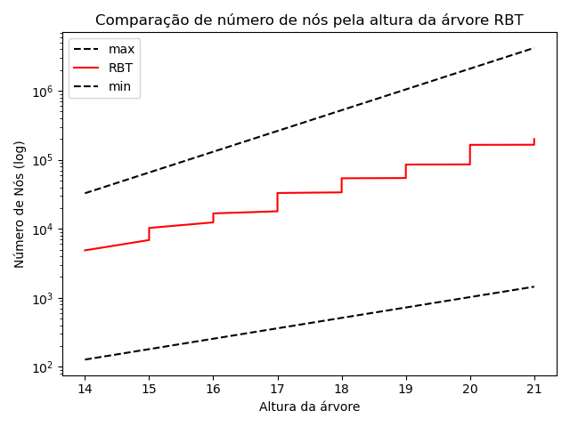

# Relatório do Projeto: Índice Invertido e Análise Comparativa de Estruturas de Dados  

* **Alunos integrantes**: Bruno Ferreira Salvi, Henrique Coelho Beltrão, Henrique Gabriel Gasparelo, José Thevez Gomes Guedes e Luiz Eduardo Bravin.
* **Professor orientador**: Matheus Telles Werner.
* **Repositório**: https://github.com/riqueu/a2-ed-2025/

---
## Resumo
Este trabalho detalha a implementação e a avaliação de desempenho de um índice invertido utilizando três estruturas de dados baseadas em árvores: a Árvore Binária de Busca (BST), a Árvore AVL e a Árvore Rubro-Negra (RBT). O objetivo foi comparar a eficiência de cada estrutura em operações de inserção e busca, aplicadas a um corpus de aproximadamente 10.000 documentos de texto. As métricas analisadas, como tempo de execução, número de comparações e altura da árvore, demonstraram a superioridade das árvores auto-balanceadas (AVL e RBT) sobre a BST, que se mostrou suscetível à degeneração. Os resultados indicaram que a RBT ofereceu o melhor tempo de inserção, enquanto a AVL se destacou por buscas ligeiramente mais rápidas e estáveis. Conclui-se que a RBT representa a escolha mais equilibrada para aplicações dinâmicas com operações frequentes de inserção e busca, e a AVL é ideal para cenários onde a velocidade de consulta é a prioridade máxima.

## 1. Introdução

Neste projeto, visa-se implementar um índice invertido, ou seja, um mapeamento de palavras e os documentos em que elas aparecem, e alocá-lo em uma estrutura de dados que otimize a busca no mesmo. Para isto, serão utilizadas as estruturas denominadas de árvores, que para o escopo deste projeto serão: **Árvore Binária de Busca (BST)**, **Árvore AVL (AVL)** e **Árvore Rubro-Negra (RBT)**, sendo as três árvores binárias de busca, entretanto com diferentes abordagens que serão exploradas nesse projeto. 

Como árvores binárias de busca, em qualquer uma das três árvores, os nós possuem no máximo 2 filhos, onde os descendentes à esquerda são anteriores, em ordem, nesse caso alfabética, ao pai e os à direita são posteriores. Desta forma, no caso ideal, a altura da árvore é proporcional a $log(n)$, possibilitando operações mais rápidas, tanto de busca quanto inserção. Logo, a diferença fundamental entre as árvores é na forma como as propriedades modificam as funções de inserção, o que impacta diretamente na organização dos nós na árvore. 

Na BST, não existe nenhuma regra adicional, além das já estabelecidas para uma árvore binária de busca, o que, portanto, possibilita uma fácil implementação das funções de inserção e busca. Apesar disso, a falta de regras que garantam o balanceamento permitem, por exemplo, a existência de casos degenerados, onde a árvore se torna uma lista encadeada e sua performance é $O(n)$ para todas as operações. Já para a AVL, são instauradas regras de balanceamento, onde, para cada nó, a diferença de altura entre suas subárvores esquerda e direita (fator de balanceamento) é no máximo 1, isso é garantido por meio de funções de rotação que alteram as alturas das subárvores. Por conta dessas restrições, as funções de inserção fazem mais alterações na árvore para boa parte dos nós inseridos. Entretanto, o balaceamento garante operações com complexidade $O(log(n))$, no pior caso. A fim de diminuir o grau de restrição da AVL, a RBT mantém o balanceamento através de um conjunto de regras que envolvem colorir cada nó de vermelho ou preto. Essas regras garantem que o caminho mais longo da raiz a qualquer folha não seja mais que o dobro do caminho mais curto, permitindo um custo operacional de $O(log(n))$, no pior caso, com uma menor rigidez que a AVL. Mesmo assim, por conta deste comportamento, a RBT pode apresentar uma altura ligeiramente maior que AVL, em determinadas situações. 

Portanto, o objetivo principal é analisar e comparar o desempenho dessas estruturas em operações fundamentais como inserção e busca, considerando diferentes volumes de dados.

## 2. Desenvolvimento

### 2.1. Metodologia de funcionamento

A comparação entre as três estruturas de dados foi realizada seguindo os passos abaixo:

1.  **Corpus de Documentos:** Foi utilizado um conjunto de aproximadamente 10.000 documentos de texto (`.txt`) com palavras já pré-processadas, com todas minúsculas e sem pontuações.
2.  **Construção do Índice:** As palavras extraídas foram inseridas como `Node` em cada uma das três estruturas de árvore (BST, AVL, RBT). Para cada palavra, o ID do documento em que ela apareceu foi adicionado à lista de documentos associada ao nó da palavra, conforme a estrutura abaixo:
```cpp
struct Node {
    std::string word;
    std::vector<int> documentIds;
    Node* parent;
    Node* left;
    Node* right;
    int height;    // usado na AVL
    int isRed;     // usado na RBT
};
```
3.  **Coleta de Métricas:** Os métricas abaixo foram calculadas para diferentes subconjuntos do corpus, variando o número de documentos processados de 100 a 10.000 documentos.
    * Tempo de inserção (média, total)
    * Tempo de busca de palavras (médio, máximo)
    * Número de comparações por operação
    * Altura da árvore
    * Tamanho dos galhos (menor e maior caminho)
    * Número de nós
    * Tamanho da árvore
4.  **Ferramentas:** A implementação das árvores e coleta de métricas foram realizadas por programas em C++. Os gráficos e análises estatísticas foram feitos utilizando a biblioteca Matplotlib de Python.

### 2.2. Código

Agora segue detalhamento das principais abordagens utilizadas no código do projeto.

Leitura dos documentos (`data.cpp`): Para a extração das palavras dos documentos, foram processados os arquivos do diretório e suas palavras foram colocadas e um vetor, nesse momento, é verificada a existência de palavras duplicadas em um arquivo, percorrendo esse vetor, e apenas os elementos únicos são inseridos. Vale salientar que a ordem de leitura dos documentos pelo iterador do diretório não necessariamente representa a ordem numérica habitual, deste modo, documentos de id superiores podem ser lidos antes dos arquivos com id inferiores.

Implementação da árvores (`bst.cpp`, `avl.cpp`, `rbt.cpp`): Para a implementação das árvores, foram desenvolvidas funções de criação, inserção, busca e deleção das mesmas, além de elaboração das funções que conservam as propriedades de balanceamento da AVL e RBT. Para a AVL, foi estipulado que a altura de nó vazio é $-1$, consequentemente, a altura das folhas é $0$, e foi considerado, como fator de balaceamento, a diferença entre as alturas das subárvores à direita e à esquerda.

Implementação dos testes (`test_bst.cpp`, `test_avl.cpp`, `test_rbt.cpp`): Para implementação dos testes, foram verificadas a consistência das regras de cada árvore, as funções de inserção e de busca.

Geração e coleta de estatísticas (`tree_utils.cpp`, `tree_stats.cpp`, `export_stats.cpp`): Para coleta das métricas, no arquivo `tree_utils.cpp`, foram implementadas funções que geram as estatísticas referentes às árvores. Estas métricas são utilizadas no CLI de estatísticas e na criação de um arquivo CSV com os dados obtidos.

Arquivos principais (`main_bst.cpp`, `main_avl.cpp`, `main_rbt.cpp`): Para utilização do código por outros usuários, no arquivo main de cada árvore, foram desenvolvidos comandos CLI para busca de uma determinada palavra, geração de estatísticas e visualização da árvore.

### 2.3 Estatísticas

Assim como supracitado, o documento `tree_utils.cpp` contém funções que coletam as estatísticas com base em parâmetros, como o tipo da árvore e a quantidade de documentos que serão inseridos. A partir dessas funções, são coletadas estatísticas como: o número total de documentos inseridos na estrutura (`n_docs`); o número médio (`numComparisonsInsertionMean`) e total (`numComparisonsInsertion`) de comparações realizadas durante as operações de inserção; o tempo médio (`executionTimeInsertionMean`) e total (`executionTimeInsertion`) de execução das inserções, medidos em milissegundos; o número médio (`numComparisonsSearchMean`) e o máximo (`numComparisonsSearchMax`) de comparações realizadas durante as buscas; o tempo máximo (`executionTimeSearchMax`) e médio (`executionTimeSearchMean`) de execução das buscas; a altura final da árvore (`treeHeight`) após todas as inserções; o comprimento do menor galho (`minBranch`); o número total de nós existentes na árvore (`numNodes`); além do tamanho total ocupado pela árvore em memória, representado em bytes (`size`).

Vale ressaltar que, neste contexto, são considerados como número de comparações a quantidade de nós que foram percorridos durante a operação, ou seja, é contabilizado cada comparação com um nó durante a inserção ou busca. Além disso, a fim de reduzir erros de medições de tempo nas estáticas de tempo de busca, para as árvores que tem 800 documentos ou menos, a busca por cada palavra é realizada 50 vezes, e então é calculado a médias desses resultados, mitigando assim, as oscilações causas pelo computador nos tempos calculados.

Essas métricas permitem a análise comparativa dos diferentes tipos de implementação de árvores, possibilitando, por exemplo, a comparação do impacto do número de documentos inseridos na altura de cada uma das árvores.

No documento `tree_stats.cpp`, utilizando as funções responsáveis pela coleta de estatísticas, são armazenadas as métricas obtidas de um tipo especificado de árvore, variando a quantidade de documentos inseridos. Essas estatísticas são então concatenadas em um arquivo CSV, o que viabiliza a plotagem dos dados e facilita a análise entre as diferentes estruturas de árvores. Vale destacar que o `tree_stats.cpp` deve ser executado separadamente para cada tipo de árvore, uma vez que o CSV gerado tem apenas as estatísticas referentes a um único tipo de árvore.

### 2.4. Divisão de Tarefas

#### 2.4.1. Entrega 1
* **Bruno Ferreira Salvi:** Implementação da função de busca para BST e da CLI (Busca) para BST;
* **Henrique Coelho Beltrão:** Implementação de funções para estatísticas, ajustes na CLI para estatísticas e construção do Makefile;
* **Henrique Gabriel Gasparelo:** Implementação das funções de print da árvore, de inserção na BST e de destroy da BST;
* **José Thevez Gomes Guedes:** Implementação das funções para leitura dos arquivos e construção do índice invertido;
* **Luiz Eduardo Bravin:** Implementação dos teste unitários da BST e inicialização da redação do relatório.

#### 2.4.2. Entrega 2

* **Bruno Ferreira Salvi:** Implementação da CLI para AVL e estatísticas extras;
* **Henrique Coelho Beltrão:** Implementação das funções da AVL, testes unitários da AVL, refatoração do código;
* **Henrique Gabriel Gasparelo:** Implementação das estatísticas para árvores;
* **José Thevez Gomes Guedes:** Implementação das estatísticas para árvores e transição para CSV;
* **Luiz Eduardo Bravin:** Implementação da análise comparativa das árvores, geração dos gráficos em Python e redação do relatório.

#### 2.4.3. Entrega 3

* **Bruno Ferreira Salvi:** Elaboração e revisão do relatório final, formulação das estatísticas extras e revisão geral do código e documentação;
* **Henrique Coelho Beltrão:**  Elaboração e revisão do relatório final, revisão geral do código, documentação, instruções de execução com novos dados e ajustes no Makefile;
* **Henrique Gabriel Gasparelo:** Implementação dos testes unitários da RBT e redação do relatório;
* **José Thevez Gomes Guedes:** Implementação das funções da RBT e redação do relatório;
* **Luiz Eduardo Bravin:** Implementação da CLI para RBT, atualização das funções úteis para comportar NIL e redação do relatório.

## 3. Resultados e Discussões

Nesta seção, serão apresentados os resultados numéricos obtidos e uma discussão sobre o desempenho comparativo das estruturas.

### 3.1. Dados Brutos

Para análise dos resultados obtidos, foram criados arquivos CSV com as métricas calculadas, onde esses dados brutos podem ser acessados pelos links de acesso abaixo.

[Tabela BST](dados_bst.csv)

[Tabela AVL](dados_avl.csv)

[Tabela RBT](dados_rbt.csv)

A seguir, serão analisados graficamente os resultados obtidos, comparando o desempenho de cada árvore implementada em uma estatística específica.

### 3.2. Gráficos e Estatísticas

#### 3.2.1. Tempo de Inserção
##### **Figura 1: Tempo de Inserção de Palavra**

##### **Discussão:** Analisando o tempo total de inserção, nota-se que a RBT apresentou o melhor desempenho, sendo consistentemente mais rápida que as outras duas. A árvore AVL, embora mantenha um tempo de inserção estável, foi ligeiramente mais lenta que a RBT, provavelmente devido ao maior número de rotações necessárias para manter seu balanceamento estrito. A BST, por sua vez, apresentou tempos médios voláteis e um tempo total que, embora próximo ao da AVL, reflete sua ineficiência estrutural.

#### 3.2.2. Tempo de Busca
##### **Figura 2: Tempo de Busca de Palavra**

##### **Discussão:** As árvores auto-balanceadas, AVL e RBT, reduziram consideravelmente o tempo de busca em relação à BST. A AVL apresentou o tempo médio de busca mais baixo e estável, confirmando que seu balanceamento rigoroso é vantajoso para consultas. A RBT teve um desempenho muito próximo ao da AVL, sendo também uma excelente opção para buscas. A BST foi a mais lenta, com picos de tempo de busca que evidenciam os problemas causados por seu desbalanceamento.

#### 3.2.3. Número de Comparações
##### **Figura 3: Número de Comparações por Inserção de Palavra**

##### **Figura 4: Número de Comparações por Busca de Palavra**

##### **Discussão:** Tanto na inserção quanto na busca, as árvores AVL e RBT realizaram um número de comparações significativamente menor que a BST. Para inserções, a RBT exigiu o menor número total de comparações, seguida de perto pela AVL, o que corrobora seus tempos de inserção mais baixos. Para buscas, a AVL se mostrou marginalmente mais eficiente, realizando, em média e no pior caso, o menor número de comparações, com a RBT apresentando resultados quase idênticos.

#### 3.2.4. Altura da Árvore
##### **Figura 5: Altura da Árvore**

##### **Discussão:** Nota-se primeiramente que existem uma grande diferença de altura entre a BST e a AVL, ou RBT, isso se dá por conta do desbalaceamento da BST que permite, em certos casos, uma altura proporcional a $n$ ao invés do $log(n)$ desejado, ao contrário da AVL e RBT, que mesmo no pior caso possuem altura proporcional a $log(n)$. Isso mostra um comportamento similar ao esperado, por conta das proporções explicadas e pela altura da RBT ser ligeiramente maior que a da AVL, uma vez que possui uma menor rigidez no balaceamento, mesmo a altura da AVL sendo semelhante a da RBT em todo o experimento. Além disso, é visível que a altura de todas as árvores não cresce muito a medida que se aumenta o número de documentos, que pode ser explicado por dois fatores: existirem muitas palavras comuns a muitos documentos, que não aumenta o número de nós já que não são palavras distintas, e o fato de que é necessário, no caso geral, inserir muitos nós para aumentar a altura de uma árvore grande, já que para isso, é necessário que o novo nó seja filho de um nó de altura máxima, no caso da BST, ou que o balaceamento esteja no limite, no caso da AVL e RBT.

#### 3.2.5. Tamanho dos Galhos (Menor e Maior Caminho)
##### **Figura 6: Tamanho do Maior e Menor Galho**

##### **Discussão:** Nota-se que a distância entre o maior e menor galho da AVL e da RBT é bem curta, enquanto na BST essa distância é exageradamente longa. Isso ocorre devido à natureza da AVL e da RBT, que são projetadas para evitar degenerações e manter a árvore balanceada, com isso balanceia-se também o tamanho dos galhos. Em contrapartida, alguns galhos da BST podem degenerar e se tornar longos demais. Outro ponto relevante é que a diferença entre o maior e o menor galho na RBT foi mais acentuada do que na AVL. Onde, o menor galho da RBT foi mais curto que o da AVL, enquanto o maior foi mais longo, o que reflete o balanceamento menos rígido da RBT em relação ao da AVL.

#### 3.2.6. Números de nós
##### **Figura 7: Número de nós**

##### **Discussão:** Nota-se que o número de nós nas três árvores é o mesmo, uma vez que o que muda em cada implementação é a forma de inserção do nó, mas nenhum nó deixa de ser inserido ou é inserido mais de uma vez. Além disso, pode-se observar um crescimento natural do número de nós, uma vez que se aumenta o número de documentos, e, consequentemente, aumentasse o número de palavras e potenciais nós. Entretanto, mesmo com esse crescimento, é possível observar leves estagnações a medida que aumenta-se o número de documentos, que provavelmente ocorre devido a existência de muitas palavras repetidas em mais de um documento que não criam novos nós, podendo existir documentos com uma série de palavras repetidas.

#### 3.2.7. Tamanho da árvore
##### **Figura 8: Tamanho da árvore**

##### **Discussão:** Comparando este gráfico com a Figura 7, é possível perceber uma possível correlação entre número de nós e o tamanho da árvore, o que pode ser explicado uma vez que o tamanho da árvore depende unicamente do tamanho de cada nó, que bem similar, uma vez que possuem a mesma estrutura. Deste modo, a medida que se aumenta o número de nós, aumenta-se o tamanho da árvore, da mesma maneira.

#### 3.2.8. Altura da árvore vs Número de nós
##### **Figura 9: Altura da Árvore vs. Número de nós BST**

##### **Discussão:** Nesse gráfico verifica-se que o número de nós computados está dentro do aceitável, entre o máximo e mínimo teórico da BST. O mínimo número de nós se dá quando a BST degenera, isto é, há um nó por camada, logo $n \geq h + 1$. O número máximo de nós se dá quando a BST está completa, isto é, há $2^{m}$ nós na camada de altura $m$, logo $n \leq 2^{h+1} -1$.

##### **Figura 10: Altura da Árvore vs. Número de nós AVL**

##### **Discussão:** Nesse gráfico verifica-se que o número de nós computados está dentro do aceitável, entre o máximo e mínimo teórico da AVL. O mínimo número de nós se dá quando se cumpre minimamente as restrições de balanceamento da AVL, logo $n \geq 2^{\frac{h}{1.44}}$. O número máximo de nós se dá quando a AVL está completa, isto é, há $2^{m}$ nós na camada de altura $m$, logo $n \leq 2^{h+1} -1$.

##### **Figura 11: Altura da Árvore vs. Número de nós AVL**

##### **Discussão:** Nesse gráfico verifica-se que o número de nós computados está dentro do aceitável, entre o máximo e mínimo teórico da RBT. O mínimo número de nós se dá quando se cumpre minimamente as restrições de balanceamento da RBT, logo $n \geq 2^{\frac{h}{2}} -1$. O número máximo de nós se dá quando a RBT está completa, isto é, há $2^{m}$ nós na camada de altura $m$, logo $n \leq 2^{h+1} -1$.

### 3.3. Resultados

Após a implementação das três estruturas de dados para aplicação do índice invertido e análise dos dados, pode-se extrair as seguintes conclusões:

#### 3.3.1. Árvore Binária de Busca (BST)

* **Vantagens:** Simplicidade de implementação, sem a necessidade de criação de funções satélites para manter regras de balanceamento.
* **Desvantagens:** Propensa à degeneração, por não possuir regras de balanceamento, sua altura, bem como a diferença entre as alturas das subárvores irmãs, depende diretamente da ordem em que as palavras são inseridas. Isso faz com que dificilmente atinja uma altura proporcional a $log(n)$, o que, por consequência, mina a eficiência das operações de busca e inserção.
* **Observado:** Os resultados confirmaram a tendência da BST ao desbalanceamento (Figuras 5 e 6), com uma altura significativamente maior e uma grande disparidade entre os galhos. O que impactou diretamente seu tempo de busca (Figura 2), que foi o mais lento entre as estruturas. E também impactou o número de comparações e tempo para inserção, que se mostraram os piores dentre as árvores (Figuras 1 e 3), já que encontrar o local para realizar a inserção é semelhante a realizar uma busca, que como observado é o mais custoso.

#### 3.3.2. Árvore Adelson-Velsky e Landis (AVL)

* **Vantagens:** Garante um tempo de busca logarítmico, mantendo a altura da árvore próxima do mínimo teórico ( $log(n)$ ).
* **Desvantagens:** Para manter o balanceamento, a árvore AVL implementa regras muito restritivas, o que faz com que muitas das novas inserções exijam ajustes na estrutura. Ajustes esses que envolvem a realização de rotações, que embora garantam a altura próxima a $log(n)$, podem aumentar o tempo da realização da operação de inserção.
* **Observado:** A AVL manteve uma altura controlada e muito menor que a BST (Figura 5), resultando em número de comparações e tempo de busca (Figuras 2 e 4) consideravelmente inferiores aos da BST, provando sua eficácia para aplicações focadas em consulta. Embora apresente um custo de inserção mais elevado em comparação à BST, esse custo foi compensado pelo balanceamento eficiente da estrutura, refletindo em um bom desempenho também nas operações de inserção (Figuras 1 e 3).

#### 3.3.3. Árvore Rubro-Negra (RBT)

* **Vantagens:** Seu critério de balanceamento menos rígido que o da AVL geralmente resulta em menos rotações durante as inserções, tornando a operação de inserção potencialmente mais rápida.
* **Desvantagens:** A altura pode ser ligeiramente maior que a de uma AVL, podendo levar a um tempo de busca um pouco maior.
* **Observado:** A RBT apresentou um tempo de inserção mais rápido que a AVL (Figura 1), resultado do menor número de rotações necessitadas pelas suas regras. Em relação à busca, a RBT mostrou-se ligeiramente menos eficiente, realizando um número maior de comparações em comparação à AVL, embora o tempo de execução tenha se mantido bastante próximo (Figuras 2 e 4). Como esperado, sua altura foi levemente superior à da AVL (Figura 5), e sua diferença entre o maior e o menor galho também foi mais acentuada (Figura 6), refletindo seu balanceamento mais afrouxado.

### 3.4. Dificuldades encontradas

* **Complexidade de Implementação:** A lógica de auto-balanceamento, especialmente as rotações simples e duplas da AVL e as funções de balaceamento da RBT, foi desafiadora e exigiu depuração extensiva.
* **Sistemas Operacionais:** Adaptar o código e o makefile para diferentes sistemas operacionais e preparar o repositório para ser acessível e reprodutível demonstrou-se algo difícil que necessitou de bastante esforço.
* **Trabalho em Equipe:** Coordenar a integração dos diferentes branchs desenvolvidas pelos membros e manter a consistência do código demandou comunicação eficaz e uso disciplinado do Git.
* **Validação dos Resultados:** Verificar e validar se os resultados obtidos eram similares aos esperados foi uma tarefa desafiadora e exigiu a produção de um grande número de testes.

## 4. Conclusão

A partir das análises, pode-se concluir que o desempenho da BST, no geral, foi insatisfatório, ao contrário da performance da AVL e RBT que obtiveram bons resultados para todas as métricas estipuladas. Mesmo assim, apesar da RBT apresentar um maior desbalanceamento quando comparada a AVL, indicada pela diferença entre o maior e menor galho e a altura da árvore, a RBT possui um desempenho tão bom quanto a AVL, uma vez que os tempos de inserção são menores ou iguais que os da AVL e os tempo de busca são similares, o que é refletido no número de comparações semelhantes entre ambas as árvores. Deste modo, conclui-se que a Árvore Rubro-Negra (RBT) é a árvore recomendada para implementação do índice invertido.
