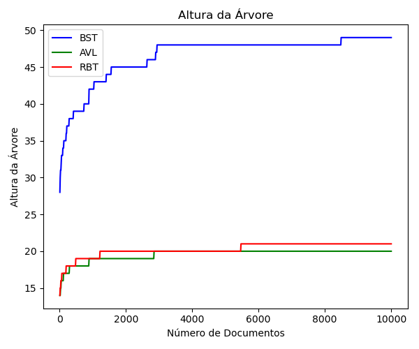
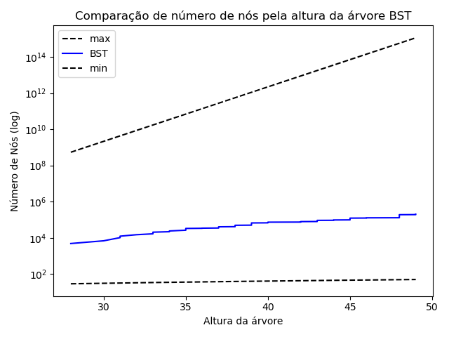

# Relatório do Projeto: Índice Invertido e Análise Comparativa de Estruturas de Dados  

* **Alunos integrantes**: Bruno Ferreira Salvi, Henrique Coelho Beltrão, Henrique Gabriel Gasparelo, José Thevez Gomes Guedes e Luiz Eduardo Bravin.
* **Professor orientador**: Matheus Telles Werner.
* **Repositório**: https://github.com/riqueu/a2-ed-2025/

---
## Resumo
Este trabalho detalha a implementação e a avaliação de desempenho de um índice invertido utilizando três estruturas de dados baseadas em árvores: a Árvore Binária de Busca (BST), a Árvore AVL e a Árvore Rubro-Negra (RBT). O objetivo foi comparar a eficiência de cada estrutura em operações de inserção e busca, aplicadas a um corpus de aproximadamente 10.000 documentos de texto. As métricas analisadas, como tempo de execução, número de comparações e altura da árvore, demonstraram a superioridade das árvores auto-balanceadas (AVL e RBT) sobre a BST, que se mostrou suscetível à degeneração. Os resultados indicaram que a RBT ofereceu o melhor tempo de inserção, enquanto a AVL se destacou por buscas ligeiramente mais rápidas e estáveis. Conclui-se que a RBT representa a escolha mais equilibrada para aplicações dinâmicas com operações frequentes de inserção e busca, e a AVL é ideal para cenários onde a velocidade de consulta é a prioridade máxima.

## 1. Introdução

Este projeto foca na implementação de um índice invertido — estrutura de dados crucial em sistemas de recuperação de informação, que mapeia palavras aos documentos em que elas aparecem, permitindo consultas mais rápidas — utilizando três estruturas de dados distintas baseadas em árvores: **Árvore Binária de Busca (BST)**, **Árvore AVL (AVL)** e **Árvore Rubro-Negra (RBT)**. O objetivo principal é analisar e comparar o desempenho dessas estruturas em operações fundamentais como inserção e busca, considerando diferentes volumes de dados.

## 2. Estruturas de Dados Utilizadas 

### 2.1. Árvore Binária de Busca (BST)
* **Descrição:** Uma árvore binária onde cada nó possui um valor (neste caso, uma palavra). Para qualquer nó, todos os valores na subárvore esquerda são menores, e os da direita são maiores (neste caso, se refere à ordem alfabética).
* **Por que usar?** É a estrutura de árvore de busca mais fundamental e simples de implementar. Sua performance é de $O(n)$ para busca e inserção no pior caso.
* **Principais Diferenças (vs AVL/RBT):** Não garante balanceamento, podendo degenerar em uma lista encadeada (pior caso $O(n)$). Menos complexa que AVL e RBT, mas sem otimizações para manter o balanceamento automático.

### 2.2. Árvore Adelson-Velsky e Landis (AVL)
* **Descrição:** É uma árvore binária de busca auto-balanceada. Para cada nó, a diferença de altura entre suas subárvores esquerda e direita (fator de balanceamento) é no máximo 1. O balanceamento é mantido através de rotações simples ou duplas após inserções.
* **Por que usar?** Garante que as operações de busca, inserção e remoção tenham complexidade de tempo de pior caso $O(\log n)$. É ideal para aplicações onde buscas frequentes são realizadas, mesmo que isso implique um custo maior nas inserções devido às rotações.
* **Principais Diferenças (vs BST/RBT):** É estritamente balanceada, o que garante o melhor desempenho para buscas. No entanto, pode realizar mais rotações durante a inserção em comparação com a RBT, o que pode torná-la mais lenta nessa operação.

### 2.3. Árvore Rubro-Negra (RBT)
* **Descrição:** Outra árvore binária de busca auto-balanceada. Ela mantém o balanceamento através de um conjunto de regras que envolvem colorir cada nó de vermelho ou preto. Essas regras garantem que o caminho mais longo da raiz a qualquer folha não seja mais que o dobro do caminho mais curto.
* **Por que usar?** Também garante complexidade de tempo de pior caso $O(\log n)$ para busca e inserção, mas o balanceamento é menos rígido que da AVL, reduzindo rotações.
* **Principais Diferenças (vs BST/AVL):** É menos estritamente balanceada que a AVL, o que pode resultar em uma altura ligeiramente maior, mas geralmente leva a um menor número de rotações em operações de inserção.

## 3. Metodologia de Comparação

A comparação entre as três estruturas de dados foi realizada seguindo os passos abaixo:

1.  **Corpus de Documentos:** Foi utilizado um conjunto de aproximadamente 10.000 documentos de texto (`.txt`) com palavras já pré-processadas, com todas minúsculas e sem pontuações.
2.  **Construção do Índice:** As palavras extraídas foram inseridas como `Node` em cada uma das três estruturas de árvore (BST, AVL, RBT). Para cada palavra, o ID do documento em que ela apareceu foi adicionado à lista de documentos associada ao nó da palavra, conforme a estrutura abaixo:
```cpp
struct Node {
    std::string word;
    std::vector<int> documentIds;
    Node* parent;
    Node* left;
    Node* right;
    int height;    // usado na AVL
    int isRed;     // usado na RBT
};
```
3.  **Coleta de Métricas:** Os métricas abaixo foram calculadas para diferentes subconjuntos do corpus, variando o número de documentos processados de 100 a 10.000 documentos.
    * Tempo de inserção (média, total)
    * Tempo de busca de palavras (médio, máximo)
    * Número de comparações por operação
    * Altura da árvore
    * Tamanho dos galhos (menor e maior caminho)
    * Número de nós
    * Tamanho da árvore
4.  **Ferramentas:** A implementação das árvores e coleta de métricas foram realizadas por programas em C++. Os gráficos e análises estatísticas foram feitos utilizando a biblioteca Matplotlib de Python e também Excel.

## 4. Resultados e Discussões

Nesta seção, apresentamos os resultados numéricos obtidos e uma discussão sobre o desempenho comparativo das estruturas.

### 4.1. Tempo de Inserção
#### **Figura 1: Tempo de Inserção de Palavra**

#### **Discussão:** Analisando o tempo total de inserção, nota-se que a RBT apresentou o melhor desempenho, sendo consistentemente mais rápida que as outras duas. A árvore AVL, embora mantenha um tempo de inserção estável, foi ligeiramente mais lenta que a RBT, provavelmente devido ao maior número de rotações necessárias para manter seu balanceamento estrito. A BST, por sua vez, apresentou tempos médios voláteis e um tempo total que, embora próximo ao da AVL, reflete sua ineficiência estrutural.

### 4.2. Tempo de Busca
#### **Figura 2: Tempo de Busca de Palavra**

#### **Discussão:** As árvores auto-balanceadas, AVL e RBT, reduziram consideravelmente o tempo de busca em relação à BST. A AVL apresentou o tempo médio de busca mais baixo e estável, confirmando que seu balanceamento rigoroso é vantajoso para consultas. A RBT teve um desempenho muito próximo ao da AVL, sendo também uma excelente opção para buscas. A BST foi a mais lenta, com picos de tempo de busca que evidenciam os problemas causados por seu desbalanceamento.

### 4.3. Número de Comparações
#### **Figura 3: Número de Comparações por Inserção de Palavra**

#### **Figura 4: Número de Comparações por Busca de Palavra**

#### **Discussão:** Tanto na inserção quanto na busca, as árvores AVL e RBT realizaram um número de comparações significativamente menor que a BST. Para inserções, a RBT exigiu o menor número total de comparações, seguida de perto pela AVL, o que corrobora seus tempos de inserção mais baixos. Para buscas, a AVL se mostrou marginalmente mais eficiente, realizando, em média e no pior caso, o menor número de comparações, com a RBT apresentando resultados quase idênticos.

### 4.4. Altura da Árvore
#### **Figura 5: Altura da Árvore**

#### **Discussão:** Nota-se que a altura da árvore não cresce tanto conforme se aumenta o número de documentos, pois nos primeiros 40 documentos acessados já são computadas e criados os respectivos nós para mais de 4 mil palavras distintas, com os outros documentos apenas acrescentando unidades a esses nós, sem criar novos. As árvores BST têm em média o dobro da altura das árvores AVL e RBT, visto que aquelas podem vir a degenerar, enquanto que estas — por serem balanceadas — organizam melhor os nós pelas camadas, reduzindo a altura. As alturas da AVL e da RBT permaneceram muito próximas durante todo o experimento.

### 4.5. Tamanho dos Galhos (Menor e Maior Caminho)
#### **Figura 6: Tamanho do Maior e Menor Galho**

#### **Discussão:** Nota-se que a distância entre o maior e menor galho da AVL e da RBT é bem curta, enquanto na BST essa distância é exageradamente longa. Isso ocorre devido à natureza da AVL e da RBT, que são projetadas para evitar degenerações e manter a árvore balanceada, com isso balanceia-se também o tamanho dos galhos. Em contrapartida, alguns galhos da BST podem degenerar e se tornar longos demais.

### 4.6. Números de nós
#### **Figura 7: Número de nós**

#### **Discussão:** Nota-se que para as três árvores os os números de nós é o mesmo, óbvio, pois todas possuem a mesma natureza de adicionar um nó para cada palavra única encontrada nos documentos e como ambas estão analisando os mesmos documentos. Nota-se algo mais interessante, no entanto, a quantidade de nós adicionados vai diminuindo conforme se aumenta a quantidade de documentos. Isso acontece pois as 4 mil palavras adicionadas nos primerios 40 arquivos são provavelmente as palavras mais utilizadas no idioma, os arquivos seguintes, portanto, estarão repletos dessas palavras que serão adicionadas aos nós já existentes e de algumas outras menos utilizadas que constituirão os novos nós. Desse modo, a cada arquivo analisado aumenta a probabilidade de uma palavra que já foi computada aparecer novamente, o que diminui a criação de novos nós pelos últimos documentos, podendo inclusive um documento não adicionar nenhum novo nó.

### 4.7. Tamanho da árvore
#### **Figura 8: Tamanho da árvore**

#### **Discussão:**


## 5. Gráficos e Estatísticas

#### **Figura 9: Altura da Árvore vs. Número de nós BST**

#### **Discussão:** Nesse gráfico verifica-se que o número de nós computados está dentro do aceitável, entre o máximo e mínimo teórico da BST. O mínimo número de nós se dá quando a BST degenera, isto é, há um nó por camada, logo $n \geq h + 1$. O número máximo de nós se dá quando a BST está completa, isto é, há $2^{m}$ nós na camada de altura $m$, logo $n \leq 2^{n+1} -1$.

#### **Figura 10: Altura da Árvore vs. Número de nós AVL**

#### **Discussão:** Nesse gráfico verifica-se que o número de nós computados está dentro do aceitável, entre o máximo e mínimo teórico da AVL. O mínimo número de nós se dá quando se cumpre minimamente as restrições de balanceamento da AVL, logo $n \geq 2^{\frac{h}{1.44}}$. O número máximo de nós se dá quando a AVL está completa, isto é, há $2^{m}$ nós na camada de altura $m$, logo $n \leq 2^{n+1} -1$.

#### **Figura 11: Altura da Árvore vs. Número de nós AVL**

#### **Discussão:** Nesse gráfico verifica-se que o número de nós computados está dentro do aceitável, entre o máximo e mínimo teórico da RBT. O mínimo número de nós se dá quando se cumpre minimamente as restrições de balanceamento da RBT, logo $n \geq 2^{\frac{h}{2}} -1$. O número máximo de nós se dá quando a RBT está completa, isto é, há $2^{m}$ nós na camada de altura $m$, logo $n \leq 2^{n+1} -1$.

## 6. Conclusão

Após a implementação das três estruturas de dados para aplicacação do índice invertido e análise dos dados, podemos extrair as seguintes conclusões:

### 6.1. Árvore Binária de Busca (BST)

* **Vantagens:** Simplicidade de implementação, constituindo uma base para o entendimento de estruturas mais complexas.
* **Desvantagens:** Suscetível à degeneração, onde a altura da árvore aproxima-se do número de nós, análogo a uma lista encadeada.
* **Observado:** Os resultados confirmaram a tendência da BST ao desbalanceamento (Figuras 5 e 6), com uma altura significativamente maior e uma grande disparidade entre os galhos. Isso impactou diretamente seu tempo de busca (Figura 2), que foi o mais lento entre as estruturas.

### 6.2. Árvore Adelson-Velsky e Landis (AVL)

* **Vantagens:** Garante um tempo de busca logarítmico, mantem a altura da árvore próxima do mínimo teórico.
* **Desvantagens:** A manutenção do balanceamento estrito pode exigir rotações mais frequentes durante as inserções, o que pode aumentar o custo dessa operação.
* **Observado:** A AVL manteve uma altura controlada e muito menor (Figura 5), resultando em número de comparações e tempo de busca (Figuras 2 e 4) consideravelmente inferiores aos da BST, provando sua eficácia para aplicações focadas em consulta.

### 6.3. Árvore Rubro-Negra (RBT)

* **Vantagens:** Seu critério de balanceamento menos rígido que o da AVL geralmente resulta em menos rotações durante as inserções, tornando-as potencialmente mais rápidas.
* **Desvantagens:** A altura pode ser ligeiramente maior que a de uma AVL, podendo levar a um tempo de busca um pouco maior.
* **Observado:** 

### 6.4. Recomendação Final 
## 7. Dificuldades Encontradas
* **Complexidade de Implementação:** A lógica de auto-balanceamento, especialmente as rotações simples e duplas da AVL, foi desafiadora e exigiu depuração extensiva. 
* **Trabalho em Equipe:** Coordenar a integração dos diferentes branchs desenvolvidas pelos membros e manter a consistência do código demandou comunicação eficaz e uso disciplinado do Git.

## 8. Divisão de Tarefas

### 8.1 Entrega 1
* **Bruno Ferreira Salvi:** Implementação da função de busca para BST e da CLI (Busca) para BST;
* **Henrique Coelho Beltrão:** Implementação de funções para estatísticas, ajustes na CLI para estatísticas e construção do Makefile;
* **Henrique Gabriel Gasparelo:** Implementação das funções de print da árvore, de inserção na BST e de destroy da BST;
* **José Thevez Gomes Guedes:** Implementação das funções para leitura dos arquivos e construção do índice invertido;
* **Luiz Eduardo Bravin:** Implementação dos teste unitários da BST e inicialização da redação do relatório.

### 8.2 Entrega 2

* **Bruno Ferreira Salvi:** Implementação da CLI para AVL e estatísticas extras;
* **Henrique Coelho Beltrão:** Implementação das funções da AVL, testes unitários da AVL, refatoração do código;
* **Henrique Gabriel Gasparelo:** Implementação das estatísticas para árvores;
* **José Thevez Gomes Guedes:** Implementação das estatísticas para árvores e transição para CSV;
* **Luiz Eduardo Bravin:** Implementação da análise comparativa das árvores, geração dos gráficos em Python e redação do relatório.

### 8.3 Entrega 3

* **Bruno Ferreira Salvi:** Elaboração e revisão do relatório final, formulação das estatísticas extras e revisão geral do código e documentação;
* **Henrique Coelho Beltrão:**  Elaboração e revisão do relatório final, revisão geral do código, documentação, instruções de execução com novos dados e ajustes no Makefile;
* **Henrique Gabriel Gasparelo:** Implementação dos testes unitários da RBT e redação do relatório;
* **José Thevez Gomes Guedes:** Implementação das funções da RBT;
* **Luiz Eduardo Bravin:** Implementação da CLI para RBT, atualização das funções úteis para comportar NIL e redação do relatório.
