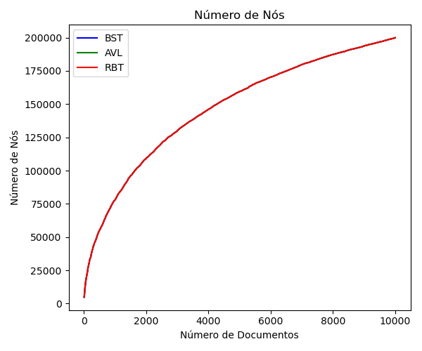

# Relatório do Projeto: Índice Invertido e Análise Comparativa de Estruturas de Dados  

* **Alunos integrantes**: Bruno Ferreira Salvi, Henrique Coelho Beltrão, Henrique Gabriel Gasparelo, José Thevez Gomes Guedes e Luiz Eduardo Bravin.
* **Professor orientador**: Matheus Telles Werner.
* **Repositório**: https://github.com/riqueu/a2-ed-2025/

---
## Resumo
-> resumo do trabalho aqui

## 1. Introdução

Este projeto foca na implementação de um índice invertido — estrutura de dados crucial em sistemas de recuperação de informação, que mapeia palavras aos documentos em que elas aparecem, permitindo consultas mais rápidas — utilizando três estruturas de dados distintas baseadas em árvores: **Árvore Binária de Busca (BST)**, **Árvore AVL (AVL)** e **Árvore Rubro-Negra (RBT)**. O objetivo principal é analisar e comparar o desempenho dessas estruturas em operações fundamentais como inserção e busca, considerando diferentes volumes de dados.

## 2. Estruturas de Dados Utilizadas 

### 2.1. Árvore Binária de Busca (BST)
* **Descrição:** Uma árvore binária onde cada nó possui um valor (neste caso, uma palavra). Para qualquer nó, todos os valores na subárvore esquerda são menores, e os da direita são maiores (neste caso, se refere à ordem alfabética).
* **Por que usar?** É a estrutura de árvore de busca mais fundamental e simples de implementar. Sua performance é de $O(n)$ para busca e inserção no pior caso.
* **Principais Diferenças (vs AVL/RBT):** Não garante balanceamento, podendo degenerar em uma lista encadeada (pior caso $O(n)$). Menos complexa que AVL e RBT, mas sem otimizações para manter o balanceamento automático.

### 2.2. Árvore AVL (Adelson-Velsky e Landis)
* **Descrição:** É uma árvore binária de busca auto-balanceada. Para cada nó, a diferença de altura entre suas subárvores esquerda e direita (fator de balanceamento) é no máximo 1. O balanceamento é mantido através de rotações simples ou duplas após inserções.
* **Por que usar?** Garante que as operações de busca, inserção e remoção tenham complexidade de tempo de pior caso $O(\log n)$. É ideal para aplicações onde buscas frequentes são realizadas, mesmo que isso implique um custo maior nas inserções devido às rotações.
* **Principais Diferenças (vs BST/RBT):** É estritamente balanceada, o que garante o melhor desempenho para buscas. No entanto, pode realizar mais rotações durante a inserção em comparação com a RBT, o que pode torná-la mais lenta nessa operação.

### 2.3. Árvore Rubro-Negra (RBT)
* **Descrição:** Outra árvore binária de busca auto-balanceada. Ela mantém o balanceamento através de um conjunto de regras que envolvem colorir cada nó de vermelho ou preto. Essas regras garantem que o caminho mais longo da raiz a qualquer folha não seja mais que o dobro do caminho mais curto.
* **Por que usar?** Também garante complexidade de tempo de pior caso $O(\log n)$ para busca e inserção, mas o balanceamento é menos rígido que da AVL, reduzindo rotações.
* **Principais Diferenças (vs BST/AVL):** É menos estritamente balanceada que a AVL, o que pode resultar em uma altura ligeiramente maior, mas geralmente leva a um menor número de rotações em operações de inserção.

## 3. Metodologia de Comparação

A comparação entre as três estruturas de dados foi realizada seguindo os passos abaixo:

1.  **Corpus de Documentos:** Foi utilizado um conjunto de aproximadamente 10.000 documentos de texto (`.txt`) com palavras já pré-processadas, com todas minúsculas e sem pontuações.
2.  **Construção do Índice:** As palavras extraídas foram inseridas como `Node` em cada uma das três estruturas de árvore (BST, AVL, RBT). Para cada palavra, o ID do documento em que ela apareceu foi adicionado à lista de documentos associada ao nó da palavra, conforme a estrutura abaixo:
```cpp
struct Node {
    std::string word;
    std::vector<int> documentIds;
    Node* parent;
    Node* left;
    Node* right;
    int height;    // usado na AVL
    int isRed;     // usado na RBT
};
```
3.  **Coleta de Métricas:** Os métricas abaixo foram calculadas para diferentes subconjuntos do corpus, variando o número de documentos processados de 100 a 10.000 documentos.
    * Tempo de inserção (média, total)
    * Tempo de busca de palavras (médio, máximo)
    * Número de comparações por operação
    * Altura da árvore
    * Tamanho dos galhos (menor e maior caminho)
    * Outros critérios que julgarem relevantes
4.  **Ferramentas:** A implementação das árvores e coleta de métricas foram realizadas por programas em C++. Os gráficos e análises estatísticas foram feitos utilizando a biblioteca Matplotlib de Python e também Excel.

## 4. Resultados e Discussões

Nesta seção, apresentamos os resultados numéricos obtidos e uma discussão sobre o desempenho comparativo das estruturas.

### 4.1. Tempo de Inserção
#### **Gráfico 1: Tempo Médio de Inserção de Palavra**

#### **Gráfico 2: Tempo Total de Inserção de Palavra**

#### **Discussão (Inserção):**

### 4.2. Tempo de Busca
#### **Gráfico 3: Tempo Médio de Busca de Palavra**

#### **Gráfico 4: Tempo Total de Busca de Palavra**

#### **Discussão (Busca):**

### 4.3. Número de Comparações
#### **Gráfico 5: Número Médio de Comparações por Inserção de Palavra**
#### **Gráfico 6: Número Total de Comparações por Inserção de Palavra**

#### **Gráfico 7: Número Médio de Comparações por Busca de Palavra**

#### **Gráfico 8: Número Total de Comparações por Busca de Palavra**

#### **Discussão (Comparações):**

### 4.4. Altura da Árvore
#### **Gráfico 9: Altura da Árvore**

#### **Discussão (Altura):** Nota-se que a altura da árvore não cresce tanto conforme se aumenta o número de documentos, pois nos primeiros 40 documentos acessados já são computadas e criados os respectivos nós para mais de 4 mil palavras distintas, com os outros documentos apenas acrescentando unidades a esses nós, sem criar novos. As árvores BST tem em média o dobro da altura das árvores AVL, visto que aquelas podem vir a degenerar, enquanto que estas — por serem balanceadas — organizam melhor os nós pelas camadas, reduzindo a altura.

### 4.5. Tamanho dos Galhos (Menor e Maior Caminho)
#### **Gráfico 10: Tamanho do Menor e Maior Galho**
#### **Discussão (Galhos):**

### 4.6. Números de nós
#### **Gráfico 11: ...**

#### **Discussão (Nós):** Nota-se que para as três árvores os os números de nós é o mesmo, óbvio, pois todas possuem a mesma natureza de adicionar um nó para cada palavra única encontrada nos documentos e como ambas estão analisando os mesmos documentos. Nota-se algo mais interessante, no entanto, a quantidade de nós adicionados vai diminuindo conforme se aumenta a quantidade de documentos. Isso acontece pois as 4 mil palavras adicionadas nos primerios 40 arquivos são provavelmente as palavras mais utilizadas no idioma, os arquivos seguintes, portanto, estarão repletos dessas palavras que serão adicionadas aos nós já existentes e de algumas outras menos utilizadas que constituirão os novos nós. Desse modo, a cada arquivo analisado aumenta a probabilidade de uma palavra que já foi computada aparecer novamente, o que diminui a criação de novos nós pelos últimos documentos, podendo inclusive um documento não adicionar nenhum novo nó.

## 5. Gráficos e Estatísticas

#### **Gráfico 12: Altura da Árvore vs. Número de nós**


## 6. Conclusão

Após a implementação das três estruturas de dados para aplicacação do índice invertido e análise dos dados, podemos extrair as seguintes conclusões:

### 6.1. Árvore Binária de Busca (BST)

* **Vantagens:**
* **Desvantagens:**
* **Observado:** 

### 6.2. Árvore AVL (Adelson-Velsky e Landis)

* **Vantagens:**
* **Desvantagens:**
* **Observado:** 

### 6.3. Árvore Rubro-Negra (RBT)

* **Vantagens:**
* **Desvantagens:**
* **Observado:** 

### 6.4. Recomendação Final 
## 7. Dificuldades Encontradas
## 8. Divisão de Tarefas

### 8.1 Entrega 1
* **Bruno Ferreira Salvi:** Implementação da função de busca para BST e da CLI (Busca) para BST;
* **Henrique Coelho Beltrão:** Adiantamente da implementação de funções para estatísticas, ajustes na CLI para estatísticas e construção do Makefile;
* **Henrique Gabriel Gasparelo:** Implementação das funções de print da árvore, de inserção na BST e de destroy da BST;
* **José Thevez Gomes Guedes:** Implementação das funções para leitura dos arquivos e construção do índice invertido;
* **Luiz Eduardo Bravin:** Inicialização da redação do relatório e implementação dos teste unitários das funções feitas nessa entrega.

### 8.2 Entrega 2

* **Bruno Ferreira Salvi:** Implementação da CLI para AVL e estatísticas extras;
* **Henrique Coelho Beltrão:** Implementação das funções da AVL, testes unitários da AVL, refatoração do código;
* **Henrique Gabriel Gasparelo:** Implementação das estatísticas para árvores;
* **José Thevez Gomes Guedes:** Implementação das estatísticas para árvores e transição para CSV;
* **Luiz Eduardo Bravin:** Implementação da análise comparativa das árvores em Pyhton e atualização do relatório.

### 8.3 Entrega 3
